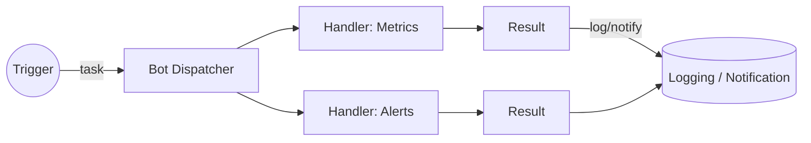

# Poseidon Bot — Observability & Ops Bot


---

This repository contains the source code for `poseidon-bot`, a lightweight, extensible bot focused on operational integrations, metric checks, and simple automation workflows.

---

## 👋 About

`poseidon-bot` is designed as an operations-first bot: easy to deploy, observable, and simple to extend with small scripts or handler modules. The project emphasizes clear separation of concerns so integrations (metrics, notifications, checks) can be added without coupling to the core dispatcher.

---

## ⭐ Highlights

- Small, testable core dispatcher in `src/bot.py`
- Script-based integrations in `scripts/` for quick custom tasks
- Container-friendly with `Dockerfile` and `docker-compose.yml`
- Intended for self-hosted deployments and CI-driven workflows

---

## 🧠 Features

- Modular handler registration model
- Structured logging and clear exit codes for supervisors
- Simple script invocation pattern for ad-hoc tasks
- Designed for easy containerization and process supervision

---

## 🛠️ Tech Stack

**Runtime:** Python 3.11+  
**Containers:** Docker, Docker Compose  
**OS target:** Linux (cloud VMs, containers)  
**CI / CD:** GitHub Actions (recommended)

---

## 🚀 Local Development

Clone the repository, create a virtual environment, install dependencies, and run the bot locally.

```bash
git clone https://github.com/yourusername/poseidon-bot.git
cd poseidon-bot
python -m venv .venv
source .venv/bin/activate
pip install -r requirements.txt  # create this file or use pyproject.toml
python src/bot.py
```

Run in Docker (recommended for parity):

```bash
docker build -t poseidon-bot .
docker run --rm poseidon-bot
# or
docker-compose up --build
```

---

## ✅ Usage Patterns

- Add a script to `scripts/` and invoke it via the dispatcher for quick automations.
- Implement a handler module with a `handle(payload)` function and register it in `src/bot.py` for structured integrations.
- Use environment variables for configuration and secrets; prefer a secret manager in production.

---

## 🔧 Configuration

- `POSEIDON_ENV` — environment (development|production)
- `NOTIFIER_ENDPOINT` — webhook or notification endpoint

Keep secrets out of source control and load them from the environment or a vault.

---

## ⚙️ Operational Notes

- Add health checks and a restart policy when running in containers or VMs.
- Use structured logs (JSON) for easier ingestion by log aggregators.
- Apply least-privilege principles to any credentials used by handlers.

---

## Contributing

1. Open an issue describing your proposal.
2. Create a focused PR with tests where applicable.

---

## Local Checklist (suggested)

- [ ] Add `requirements.txt` or pin dependencies in `pyproject.toml`
- [ ] Provide an example handler wired into `src/bot.py`
- [ ] Add a lightweight GitHub Actions CI workflow for linting and tests

---

## License

Choose an appropriate license for the project.

--

Design-first README

This README is organized to quickly communicate the intent, architecture, design choices, and how to get started developing and deploying `poseidon-bot`.

**Project Goals**

- **Reliable integrations:** Provide stable connectors to metrics and operational tooling.
- **Minimal, testable core:** Keep the runtime small and easy to reason about.
- **Extensible:** Simple hooks and clear separation of concerns so new features are plug-and-play.

**When to use this project**

- Lightweight automations and monitoring workflows for small teams.
- Integrating alerts, periodic checks, or simple chat ops without heavy orchestration.

## Design Overview

High-level principles that guided the implementation:

- **Single Responsibility:** `src/bot.py` runs the primary bot loop and delegates responsibilities to small modules.
- **Observability-first:** structured logging and explicit exit codes make it easy to run under process supervisors or containers.
- **Composable integrations:** individual scripts in `scripts/` provide isolated behaviors that can be invoked by the bot.

### Core Components

- `src/bot.py` — main entry point and message/command dispatch.
- `scripts/` — collection of small utility scripts (e.g., `ai-status.py`, `hello.py`) that demonstrate integration points and can be invoked by the bot.
- `Dockerfile` / `docker-compose.yml` — containerized deployment and local composition for testing.
- `host-metrics/` — placeholder for metric collectors and exporters.

## Architecture

The bot follows a simple producer-dispatcher model:

1. Triggers (scheduled jobs, incoming messages, or system events) publish tasks.
2. The bot dispatcher receives tasks and routes them to the appropriate handler (built-in or script).
3. Handlers perform work (e.g., check metrics, call APIs) and return structured results.
4. Results are logged and optionally emitted as notifications.

Mermaid diagram (flow):



## Setup & Quick Start

Prerequisites: Python 3.11+, Docker (optional for containerized runs).

Local (fast):

1. Create and activate a virtual environment

```bash
python -m venv .venv
source .venv/bin/activate
pip install -r requirements.txt  # if present
```

2. Run the bot directly

```bash
python src/bot.py
```

Containerized (recommended for consistent environments):

```bash
docker build -t poseidon-bot .
docker run --rm poseidon-bot
# or with compose
docker-compose up --build
```

## Usage Patterns

- Lightweight command: add a new script under `scripts/` and wire it into the dispatcher.
- Periodic checks: use cron-style scheduling or an external scheduler to trigger the bot with a task payload.
- Extending integrations: create a handler module that implements a `handle(payload)` function and register it in `src/bot.py`.

## Development Notes

- Coding style: keep handlers small and side-effect free where possible.
- Tests: keep logic-driven code easily testable by extracting side effects (I/O, network) behind interfaces.
- Logging: prefer structured logs (JSON) for easy ingestion by log aggregators.

## Configuration

- Environment variables should be the primary configuration mechanism for credentials and endpoints.
- Example variables:
  - `POSEIDON_ENV` (development|production)
  - `NOTIFIER_ENDPOINT`

Store secrets in your environment or a secret manager; avoid committing them to source.
